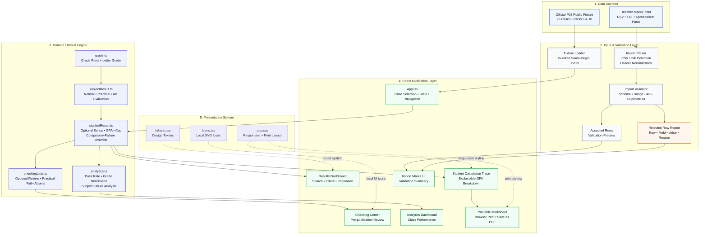
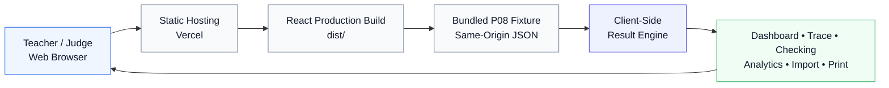

# ResultGuard

**Rule-accurate school result processing, GPA calculation, explainability, and pre-publication validation for LofiStack Hackathon 2026 — P08.**

| Project Metadata | Value |
|---|---|
| Team | `LSH26-T023` |
| Problem | `P08 — School Result Processing and GPA Engine` |
| Product | `ResultGuard` |
| Application Type | Client-side React + TypeScript web application |
| Evaluation Dataset | Official organizer-provided P08 public fixture |
| Automated Tests | 43 |
| Test Files | 6 |

## Executive Overview

ResultGuard is a school result-processing application designed around one principle: a published GPA should be both correct and explainable.

The application calculates subject grade points, final GPA, letter grades, practical-component failures, optional-subject bonuses, absence handling, and compulsory-failure overrides according to the P08 rules. It then exposes those calculations through a searchable results dashboard, a per-student calculation trace, and pre-publication checking lists.

The project also includes three product-level extensions: class analytics, a printable individual marksheet, and marks-sheet validation for CSV or spreadsheet-pasted data.

No GPA calculation is duplicated inside the UI. The calculation engine remains the single source of truth.

---

## Problem Context

School result processing is deceptively sensitive to edge cases.

A student can have a high average but still fail overall because one compulsory subject failed. A practical subject can have a passing total while failing because either its theory or practical component missed the required threshold. `AB` must remain distinguishable from a real numeric zero. An optional subject affects GPA differently from a compulsory subject.

ResultGuard makes those rules explicit, testable, and visible to the user before publication.

---

## Delivered P08 Scope

### Required MVP Coverage

| Requirement Area | ResultGuard Implementation |
|---|---|
| Public school-result dataset | Uses the official P08 fixture containing both Class 9 and Class 10, compulsory and optional subjects, normal and theory/practical subjects, and hard edge cases |
| Exact result processing | Central engine calculates subject status, subject GP, optional bonus, final GPA, letter grade, cap, and compulsory-failure override |
| Per-student calculation trace | Every student can be opened in a trace view showing marks, component checks, GP, applied rule, raw/capped calculation, failure override, and final outcome |
| Pre-publication checking lists | Separate Optional Review, Practical Fail, and Absent lists are derived from engine flags; the same student may appear in multiple lists |

### Bonus Features Implemented

| Bonus | Implementation |
|---|---|
| Class Summary Dashboard | Student count, pass rate, average final GPA, grade distribution, compulsory-subject failure ranking, most-failed subject, and failure-reason breakdown |
| Printable Individual Marksheet | Clean print-oriented student result sheet with subject marks, GP, final GPA, grade, optional bonus, calculation, failure override, and signature areas |
| Marks Sheet Paste / Upload Validation | CSV or text upload plus Excel/Google Sheets-style pasted tables, accepted/rejected summary, schema checks, and exact rejected-row reasons |

---

## Core GPA Rules

### Normal Subject Grade Bands

| Mark | Grade Point |
|---:|---:|
| 80–100 | 5.0 |
| 70–79 | 4.0 |
| 60–69 | 3.5 |
| 50–59 | 3.0 |
| 40–49 | 2.0 |
| 33–39 | 1.0 |
| Below 33 | 0.0 |

The normal-subject mark must be within 0–100.

### Theory / Practical Subjects

A practical subject contains two separately validated components.

| Component | Maximum | Passing Threshold |
|---|---:|---:|
| Theory | 75 | 25 |
| Practical | 25 | 8 |

Both thresholds are inclusive.

A student with theory 24 and practical 20 fails the subject even though the practical component passed. A student with theory 60 and practical 7 also fails. If either required component fails, the subject GP becomes 0 regardless of the combined total.

Only after both components pass is the combined mark evaluated against the normal grade-point bands.

### Absence

`AB` is a first-class result state. It is never silently converted to numeric zero.

| Situation | Behaviour |
|---|---|
| Compulsory subject is `AB` | Subject GP 0 and the compulsory-failure override applies |
| Optional subject is `AB` | No optional bonus; does not independently fail the overall result |
| Numeric mark is `0` | Real mark of zero; it is not classified as absence |

For imported theory/practical data, both components must be `AB` to represent a practical-subject absence. A one-sided `AB` is rejected by import validation.

### Optional Subject Bonus

The optional subject contributes only the amount above GP 2.0.

    optionalBonus = max(0, optionalGP - 2)

The GPA calculation uses six compulsory subjects as its divisor:

    rawGPA = (sumOfSixCompulsoryGPs + optionalBonus) / 6

The result is capped at 5.00 and displayed to two decimal places.

### Compulsory Failure Override

Any failed compulsory subject overrides the otherwise calculated GPA.

    any compulsory failure
            ↓
    Final GPA = 0.00
    Letter Grade = F

The trace still preserves and displays the calculated GPA before that failure override so a reviewer can understand what happened.

### Final Letter Grade

| Final GPA | Letter |
|---:|---|
| 5.00 | A+ |
| 4.00–4.99 | A |
| 3.50–3.99 | A- |
| 3.00–3.49 | B |
| 2.00–2.99 | C |
| 1.00–1.99 | D |
| Compulsory failure / below 1.00 | F |

---

## Pre-Publication Checking Center

The checking center is intended to help a school office identify records that deserve attention before publication.

| List | Membership Rule |
|---|---|
| Optional Review | Optional subject GP is less than or equal to 2.0; optional `AB` also qualifies |
| Practical Fail | An actual practical component exists and is below 8 |
| Absent | Any subject contains the distinct `AB` state |

A student can appear in multiple lists.

A theory failure with practical 8 or higher does not qualify for the Practical Fail list. `AB` is also not treated as a practical mark of zero.

---

## Calculation Trace

The Student Trace view exposes the calculation rather than showing only the final number.

It includes subject-level marks, theory/practical component status, subject GP, pass/fail/AB state, the rule used for each subject, compulsory GP sum, optional GP, optional bonus, raw GPA, capped pre-override GPA, failed compulsory subjects, final GPA, and final letter grade.

This design makes edge cases reviewable by a teacher or school administrator without requiring them to reconstruct the formula manually.

---

## Class Analytics

The Analytics view is derived from final `StudentResult` objects rather than recalculating pass/fail independently.

It provides class or all-class scope selection, total students, pass/fail counts, pass rate, average final GPA, final letter-grade distribution, compulsory-subject failure ranking, most-failed subject, and absence/theory/practical/below-33 failure breakdown.

Optional-subject failure never incorrectly changes the overall pass rate.

---

## Marks Sheet Import Validation

ResultGuard accepts data in two judge-visible workflows:

| Input | Support |
|---|---|
| CSV file | Yes |
| Plain text file containing compatible delimited data | Yes |
| Excel / Google Sheets copy-paste | Yes, through tab-delimited pasted table data |
| Binary `.xlsx` workbook | Not implemented |

The parser supports comma-separated or tab-separated tables and quoted CSV values.

Expected identity fields support common aliases for student ID/roll, name, class, and optional subject. Subject columns can use defined subject codes or supported names. Practical subjects use separate theory and practical columns.

### Import Validation Rules

| Data | Accepted |
|---|---|
| Normal subject | `0–100` or `AB` |
| Theory component | `0–75` or `AB` |
| Practical component | `0–25` or `AB` |
| Required student identity fields | Must be present |
| Student ID | Must not be duplicated within the imported table |
| Optional subject | Must exist and must not also be compulsory |
| Practical absence | Theory and practical must both be `AB` |
| Extra row values | Rejected as row-structure error |

Rejected values produce a report containing source row, student, field, submitted value, and exact reason.

### Important Import Limitation

The current bonus validates and previews accepted imported students, but it does not persist them and does not replace the active organizer-provided fixture used by the dashboard.

This boundary is intentional in the hackathon version: invalid data is demonstrated as being blocked before result processing without introducing persistence or destructive dataset replacement late in the workflow.

---

## Printable Individual Marksheet

A student trace includes a `Print Marksheet` action.

The print layout contains student identity, class and optional subject, subject-level result table, practical split marks where relevant, GP and status, optional bonus, GPA formula, capped GPA, final GPA/grade, compulsory-failure override details when applicable, signature areas, and generation date.

The implementation uses the browser print system. A user can therefore print physically or choose the browser/operating-system `Save as PDF` destination without adding a PDF-generation dependency.

---

## Official P08 Public Fixture

The bundled evaluation fixture reports:

| Fixture Property | Value |
|---|---:|
| Schema version | 2.1 |
| Problem ID | P08 |
| Public cases | 25 |
| Student records across all cases | 1,765 |
| Records per case | 60–80 |
| Classes | Class 9 and Class 10 |
| Subject definitions per case | 9 |
| Compulsory subjects per case | 6 |

The word “records” is intentional: the 1,765 value is the sum of student records across the 25 public cases and is not presented as 1,765 unique real-world students.

The fixture is bundled with the deployed application and is loaded from the same origin. No external runtime data API is required.

---

## System Architecture

ResultGuard follows a layered architecture that keeps **domain rules, input validation, presentation, and print/export concerns separated**.

The result engine is the single source of truth for GPA-related decisions. UI components consume calculated results instead of reimplementing academic rules.

### Architecture Responsibilities

| Layer | Responsibility |
|---|---|
| **Data Sources** | Supplies the official P08 evaluation fixture and teacher-provided marks input |
| **Input & Validation** | Loads the fixture and parses/validates uploaded or pasted marks before they are accepted |
| **Domain Engine** | Owns every academic rule: subject GP, practical thresholds, AB semantics, optional bonus, GPA, cap, compulsory-failure override, checking flags, and analytics |
| **React Application** | Manages case selection, navigation, result presentation, filters, trace views, analytics, import reporting, and marksheet actions |
| **Presentation System** | Provides reusable visual tokens, responsive layouts, local SVG icons, and print-specific styling |

### Result Processing Flow

The primary evaluation path is:

`Official Fixture → App State → Subject Evaluation → Student Result → Dashboard / Trace / Checking Center / Analytics`

For each student, `studentResult.ts` delegates subject-level decisions to `subjectResult.ts`, which in turn uses the grade-boundary functions in `grade.ts`.

This keeps academic policy out of presentation components and makes the result rules independently testable.

### Import Validation Flow

The import bonus follows a deliberately separate path:

`CSV / Spreadsheet Paste → Parser → Validator → Accepted Preview / Rejected Row Report`

The parser handles comma-separated and tab-separated tables and normalizes headers.

The validator checks required identity fields, subject columns, duplicate student IDs, optional-subject validity, normal marks, theory/practical ranges, `AB`, malformed practical absence, and row-structure errors.

> **Current boundary:** accepted imported rows are validated and previewed but are not persisted and do not replace the organizer-provided active fixture.

This keeps the hackathon evaluation dataset deterministic while still demonstrating how invalid school data can be blocked before result processing.

### Single Source of Truth

A critical design rule in ResultGuard is:

**UI components never calculate GPA independently.**

All academic calculations flow through the domain engine:

- `grade.ts`
- `subjectResult.ts`
- `studentResult.ts`
- `checkingLists.ts`
- `analytics.ts`

As a result, the dashboard, student trace, checking lists, analytics view, and printable marksheet all remain consistent with the same underlying result model.

### Deployment Architecture

ResultGuard is deployed as a static client-side application:

Because the application has no runtime backend, database, authentication server, or external API dependency, deployment only requires building the frontend and publishing the generated `dist/` directory.

## Source Layout

    src/
      components/
        Analytics.tsx
        CheckingCenter.tsx
        FilterBar.tsx
        ImportMarks.tsx
        PrintableMarksheet.tsx
        ResultsTable.tsx
        StudentTrace.tsx
        ...

      engine/
        analytics.ts
        checkingLists.ts
        grade.ts
        studentResult.ts
        subjectResult.ts

      import/
        parser.ts
        types.ts
        validator.ts

      styles/
        app.css
        tokens.css

      tests/
        analytics.test.ts
        checkingLists.test.ts
        grade.test.ts
        importValidation.test.ts
        studentResult.test.ts
        subjectResult.test.ts

      types/
        models.ts

    public/
      data/
        P08_school_results_public.json

`src/engine/` contains domain calculations.

`src/import/` contains source-data parsing and validation.

`src/components/` presents already-calculated results.

`src/styles/tokens.css` defines the visual design tokens, while `src/styles/app.css` owns component layout, responsiveness, and print behaviour.

---

## Data Model Design

The central `SubjectMark` model deliberately represents three different data shapes:

    number
    "AB"
    { theory, practical }

That separation prevents absence from being conflated with numeric zero and prevents a practical subject from losing its component-level information.

`StudentResult` stores calculated subject results, optional GP/bonus, uncapped and capped calculation values, compulsory-failure state, final GPA/letter grade, and checking-list flags.

---

## Automated Testing

The final suite contains 43 automated tests across six files.

| Test File | Tests | Main Coverage |
|---|---:|---|
| `grade.test.ts` | 16 | Grade bands and letter-grade boundaries |
| `subjectResult.test.ts` | 4 | Subject evaluation, practical thresholds, AB semantics |
| `studentResult.test.ts` | 6 | Optional bonus, divisor, cap, failure override, flags |
| `checkingLists.test.ts` | 1 | Pre-publication list membership |
| `analytics.test.ts` | 3 | Pass rate, grade distribution, failure analysis |
| `importValidation.test.ts` | 13 | CSV/tab parser, AB handling, ranges, duplicate IDs, rejected-row reasons |
| **Total** | **43** | **Rule and validation regression coverage** |

Run the suite with:

    npm test

---

## Technology Stack

| Layer | Technology |
|---|---|
| UI | React 19 |
| Language | TypeScript 6 |
| Build / development | Vite 7 |
| Unit testing | Vitest 4 |
| Static analysis | Oxlint |
| Styling | Project-authored CSS and design tokens |
| Data source | Bundled organizer-provided JSON fixture |

No chart library, icon package, UI component library, state-management package, backend SDK, database SDK, authentication SDK, or PDF-generation package is required.

---

## Local Development

### Requirements

Use Node.js 20.19+ or 22.12+ and npm.

### Install

    npm install

### Start Development Server

    npm run dev

Vite prints the local URL in the terminal. If the default port is already occupied, Vite may automatically select another available port.

### Run Tests

    npm test

### Run Lint

    npm run lint

### Production Build

    npm run build

The static production output is generated in:

    dist/

### Preview Production Build

    npm run preview

---

## Deployment

ResultGuard is designed as a static frontend deployment.

No environment variables, server process, database migration, secret, authentication configuration, or external API credentials are required.

A production host only needs to install dependencies and execute:

    npm run build

Then publish:

    dist/

The final live URL is supplied through the hackathon submission after the release commit and deployment.

---

## Mocked, Local, and External Behaviour

| Area | Final Hackathon Behaviour |
|---|---|
| School result data | Organizer-provided public P08 fixture bundled locally |
| Backend API | None |
| Database | None |
| Authentication | None |
| AI API | None |
| Runtime third-party API | None |
| Import persistence | None; validation/preview only |
| Imported rows replacing fixture | Not implemented |
| Analytics | Real calculations over current engine results |
| Marksheet | Real browser-print output from current student result |
| Checking lists | Real derived engine output |

There is no fake HTTP backend pretending to persist school data.

The public fixture functions as the deterministic evaluation dataset for the hackathon implementation.

---

## Privacy and Network Behaviour

The application does not require students' data to be sent to a third-party service.

The bundled fixture is loaded from the application's own deployment origin. Pasted/uploaded validation data is processed client-side in the browser and is not persisted by a backend.

---

## Current Limitations

| Limitation | Current Behaviour |
|---|---|
| Persistent school storage | Not implemented |
| Login / role-based access | Not implemented |
| Direct SIS integration | Not implemented |
| Binary Excel `.xlsx` parsing | Not implemented |
| Applying accepted import rows to active dataset | Not implemented |
| Server-generated PDF | Not required; browser print / Save as PDF is used |
| Multi-school administration | Not implemented |

These limitations do not change the implemented P08 GPA rules.

---

## What Would Be Built Next

A production version would connect validated imported rows to an explicit review-and-apply workflow, persist approved datasets, add school/user authentication and role-based access, support direct `.xlsx` workbook import, provide class-wide export/report generation, record result publication history, and integrate with a school information system where required.

The GPA engine would remain isolated and testable rather than moving rule calculations into UI or API handlers.

---

## Third-Party Licenses and Assets

See [`LICENSES.md`](LICENSES.md) for the complete direct and transitive dependency inventory, licenses, organizer-provided data declaration, and asset provenance.

The final release dependency tree is audited before commit for prohibited or unknown third-party licenses.

---

## Event Record

`EVENT.md` contains the event-start declaration, team/problem metadata, start code, and pre-event-material declaration.

Repository history is preserved as required for the hackathon.

---

## Frontend Maintenance

See [`FRONTEND_GUIDE.md`](FRONTEND_GUIDE.md) for the architecture boundary between domain logic and presentation, safe visual-upgrade areas, current component map, and print/responsive guidance.

